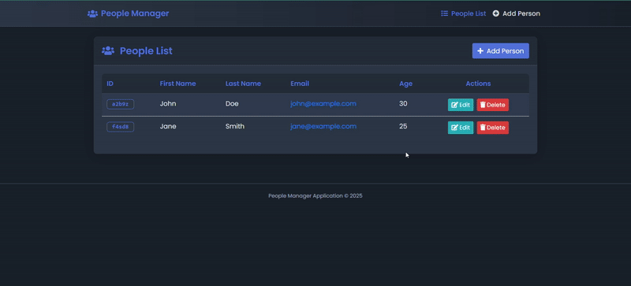

# People Manager Angular Application

A Single Page Application built with Angular 7 to manage a list of people with full CRUD operations. This application features a modern dark-themed UI, reactive forms with validation, and a clean component-based architecture.

## Features

- **Complete CRUD Operations:**
  - View a list of all people
  - Add a new person with form validation
  - Edit existing person details
  - Delete a person with confirmation dialog

- **Modern UI:**
  - Responsive dark-themed interface
  - Custom styling for ID badges and components
  - Font Awesome icons integration
  - Form validation with visual feedback
  - Loading states and animations

- **Technical Features:**
  - Component-based architecture
  - Reactive form validation
  - Observable pattern for data handling
  - Type-safe models
  - One-command startup

## Technology Stack

- **Frontend:** Angular 7
- **UI Framework:** Bootstrap 4
- **Form Handling:** Angular Reactive Forms
- **API Integration:** Angular HttpClient
- **Mock Backend:** JSON Server
- **Styling:** Custom dark theme with CSS variables
- **Icons:** Font Awesome 5
- **Development:** Concurrently for parallel server execution

## Setup Instructions
1. Clone the repository: `git clone https://github.com/nirajkumaryadav/People-Manager.git` cd People-Manager
2. Install dependencies: `npm install`
3. Start both the Angular app and JSON Server with one command: `npm start`
4. Open your browser and navigate to:
- Angular Frontend: http://localhost:4200
- JSON Server API: http://localhost:3000/people

## Development Commands

- **Start both servers:** `npm start`
- **Start frontend only:** `npm run start:frontend`
- **Start JSON Server only:** `npm run start:api`
- **Build for production:** `npm run build`
- **Run tests:** `npm run test`

## REST API Endpoints

| Method | URL                | Description              |
|--------|--------------------| ------------------------ |
| GET    | /people            | Get all people           |
| GET    | /people/:id        | Get a single person      |
| POST   | /people            | Create a new person      |
| PUT    | /people/:id        | Update a person          |
| DELETE | /people/:id        | Delete a person          |

## Implementation Highlights

- **Dark Theme:** Custom dark theme implementation with CSS variables for consistent styling
- **Reactive Forms:** Form validation with immediate feedback
- **ID Generation:** Consistent 5-character alphanumeric IDs for all entries
- **Error Handling:** Proper error state management and user feedback
- **Loading States:** Visual indicators during async operations
- **Enhanced UX:** Responsive design for all device sizes

## References

This project was built using concepts from:
- [IBM Angular SPA Implementation](https://www.ibm.com/developerworks/library/wa-implement-a-single-page-application-with-angular2/index.html)
- [Angular HttpClient with REST APIs](http://javasampleapproach.com/frontend/angular/use-angular-httpclient-post-put-delete-data-springboot-rest-apis-angular-4)
- [Getting Started with Angular](https://scotch.io/courses/getting-started-with-angular-2)
- [Progressive Angular Applications](https://houssein.me/progressive-angular-applications)
- [Angular Tutorial](https://angular.io/tutorial)

## License

MIT

## Author

Niraj Kumar Yadav
